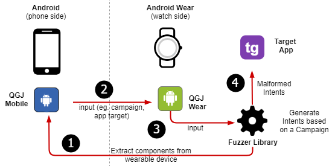
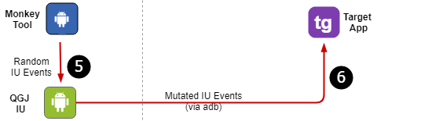

## QGJ

### Description

QGJ (Qui-Gon Jinn). A fuzz testing tool for Android Wear apps and service. QGJ is a simple user-level tool (i.e., does not need rooted devices) for testing the robustness of Android Wear and Android apps. QGJ consist of two components:
 * QGJ-Master: An Android app for sending generated intercomponent communication messages (intents) to targeted applications
 * QGJ-UI: A tool based on [Android Monkey fuzzer](https://developer.android.com/studio/test/monkey.html), which can send mutated (malformed) UI events to the wearable device.

Specific instructions for setup and run each tool are in their respective subfolder.

### Architecture

The operational workflow of using QGJ for doing a fuzz-based injection of apps on the mobile device (a phone is shown here) or the wearable (a watch is shown here) is shown in the next figure. Even though that is possible to fuzz QGJ mobile apps, the diagram does not include a target on the mobile side for clarity since this study is focused on fuzzing Android Wear apps.

### Reference

E. Barsallo Yi, A. Maji, and S. Bagchi. ["How Reliable is my Wearable: A Fuzz Testing-based Study."](https://engineering.purdue.edu/dcsl/publications/papers/2018/final_android-wear-robustness_dsn18_cameraready.pdf) Dependable systems and networks (DSN), 2018 48th annual IEEE/IFIP international conference on. IEEE, 2018.
